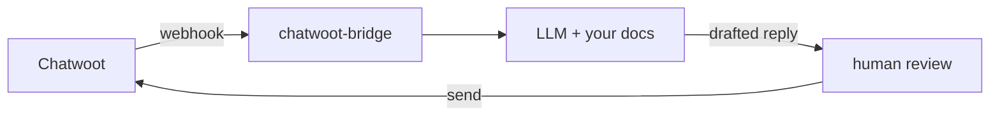

# chatwoot-bridge

Self-hosted bridge that turns Chatwoot conversations into AI-drafted replies using any LLM (Ollama, OpenAI, DeepSeek, etc.), grounded in your own docs and past conversations — no third-party SaaS, no per-seat subscription.

## Architecture



## Quick Start

```bash
git clone https://github.com/ramch14324/chatwoot-bridge.git
cd chatwoot-bridge
cp .env.example .env
# Fill in the 4 required values in .env:
#   CHATWOOT_URL, CHATWOOT_API_TOKEN, LLM_API_BASE, LLM_MODEL
docker compose up -d
```

## Features

| Feature | Description |
| --- | --- |
| Self-hosted | Runs entirely on your own infrastructure — no third-party SaaS or per-seat subscription. |
| Any LLM | Works with any OpenAI-compatible endpoint (Ollama, OpenAI, DeepSeek, etc.). |
| Grounded replies | Drafts answers from your own docs and past conversations (RAG memory). |
| Human-in-the-loop | Replies are drafted for agent review before sending, never sent automatically. |
| Chatwoot-native | Integrates via Chatwoot webhooks and API — no forking or patching Chatwoot. |
| Multi-source polling | Optional config-driven polling of any simple JSON API into Chatwoot conversations. |

## Setup

See [`docs/setup.md`](docs/setup.md) for required `.env` values and
first-run instructions, and [`docs/troubleshooting.md`](docs/troubleshooting.md)
for common issues.

## Project structure

- `src/chatwoot_bridge/` — the service (connectors, LLM access, memory/RAG, orchestration, webhook API)
- `docs/` — setup and troubleshooting docs
- `scripts/` — standalone scripts for verifying each piece of the stack against a real endpoint
- `tests/` — unit tests

## Webhook delivery and private networks

Chatwoot's webhook delivery (`WebhookJob`) runs every webhook URL through
`SafeFetch`, which rejects any URL resolving to a private IP address
unless `SAFE_FETCH_ALLOW_PRIVATE_NETWORK=true` is set on the Chatwoot
side. Whether you need this depends on your deployment:

1. **Chatwoot self-hosted + chatwoot-bridge on the same private network**
   (e.g. same LAN, same Docker host) - requires
   `SAFE_FETCH_ALLOW_PRIVATE_NETWORK=true` in Chatwoot's own `.env`
   (`rails` and `sidekiq` services), applied with `docker compose up -d
   rails sidekiq` (a plain `restart` does not pick up new env vars).
2. **Chatwoot self-hosted + chatwoot-bridge on a public server** (VPS,
   domain name) - no special setting needed.
3. **Chatwoot Cloud + chatwoot-bridge on a public server** - no special
   setting needed.
4. **Chatwoot Cloud + chatwoot-bridge on a private network** - not
   possible. Chatwoot Cloud's SSRF guard cannot be disabled by an
   individual customer, so chatwoot-bridge must be publicly reachable
   in this case.

`SAFE_FETCH_ALLOW_PRIVATE_NETWORK` is not webhook-specific - it is a
single shared toggle that also loosens SSRF protection for Chatwoot's
avatar-from-URL, website-branding-fetch, and upload-by-URL features.
Evaluate your own threat model (multi-user instance vs. a trusted
single-user/admin instance) before enabling it, rather than treating it
as a webhook-only setting.

## About

Built by Appsork. Independent project, not affiliated with Chatwoot.

**Development notes:** Parts of this project were developed with
the assistance of AI coding tools.

This software is provided "as is," without warranty of any kind,
per the MIT License below. Review and test it in your own
environment before relying on it in production.
